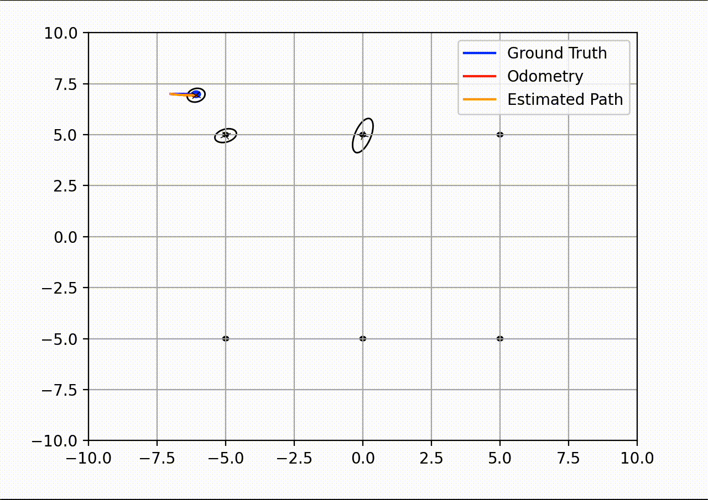
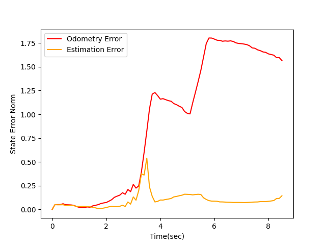

# Simultaneous Localization and Mapping (SLAM) with EKF

This project addresses the problem of Simultaneous Localization and Mapping (SLAM) with unknown correspondences using an Extended Kalman Filter (EKF) algorithm. SLAM is crucial in robotics, enabling a robot to estimate its environment and determine its own state (position and orientation) by utilizing sensor measurements and motion models.

The Kalman Filter integrates predictions from a motion model with sensor data, providing a robust estimate of the system's position while accounting for uncertainty and noise in both measurements and models. The results are validated through simulations of a differential drive robot, demonstrating the effectiveness of the proposed approach.

